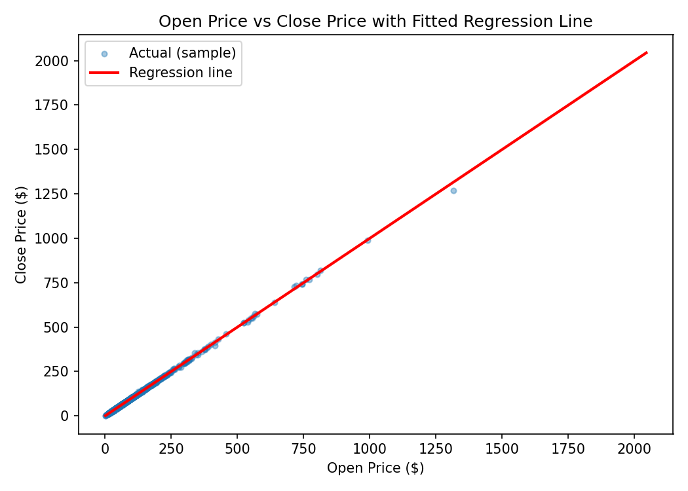
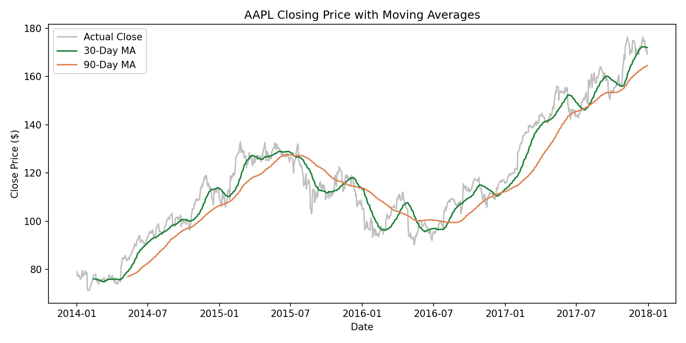

# Level 2 Analytics - Regression, Time Series & Clustering on Stock Price Data

## Description

This repository covers all three **Level 2 (Intermediate)** tasks of the Codveda Technologies data analytics internship, each applied to the same cleaned stock prices dataset: a simple linear regression, a time series decomposition, and a clustering analysis. Keeping them in one repo reflects that they share a dataset and a cleaning pipeline rather than being unrelated projects.

| Task | Notebook | Status |
|---|---|---|
| 1. Regression Analysis | `regression_analysis.ipynb` | 
| 2. Time Series Analysis | `time_series_analysis.ipynb` | 
| 3. Clustering Analysis (K-Means) | `clustering_analysis.ipynb` |

## Dataset

A daily OHLCV (open, high, low, close, volume) dataset covering **505 stock symbols from 2014–2017** (497,472 rows). Before any modeling, the data was cleaned:

- Parsed `date` into a proper datetime column
- Dropped rows with missing `open`/`high`/`low` values (19 rows)
- Checked for and removed duplicate rows (none found)
- Checked for and removed any non-positive prices (none found)

The cleaned dataset is saved as `cleaned_stock_prices.csv` and reused across all three notebooks.

---

## Task 1: Regression Analysis

**Objectives:** split the dataset into training and testing sets, fit a linear regression model with scikit-learn, and interpret the coefficients and evaluation metrics (R-squared, MSE).

The model predicts **closing price** from **opening price** (`close = f(open)`). These two variables correlate at ~0.9999 same-day, making them a clean, interpretable pair for a first regression task — and the strength of that relationship is itself a useful finding: stocks rarely move far from their open within a single trading day.

The data was split 80/20 into training and testing sets (`random_state=42` for reproducibility), and a `LinearRegression` model was fit on the training set.

| Metric | Value |
|---|---|
| Slope (coefficient) | ≈ 1.00 |
| Intercept | ≈ 0.03 |
| R-squared | ≈ 0.9997 |
| MSE | ≈ 2.73 |
| RMSE | ≈ 1.65 |

A slope near 1 with an intercept near 0 means closing price tracks opening price almost exactly — a $1 move in the open price predicts roughly a $1 move in the close price, with very little drift. An R² above 0.999 confirms open price alone explains almost all the variation in close price.



---

## Task 2: Time Series Analysis

**Objectives:** plot time-series data and identify patterns, decompose the series into trend, seasonality, and residuals using `statsmodels`, and perform moving average smoothing.

Since the raw dataset is panel data (505 stocks mixed together), this task isolates a single symbol, **AAPL**, to get a true daily time series: 1,007 trading days from 2014–2017 with no gaps or duplicate dates.

- **Trend:** a clear long-term upward climb, but not a straight line — there are multi-month declines (mid-2015, most of 2016) inside the broader uptrend.
- **Seasonality:** a repeating yearly shape, rising into mid-year and dipping toward year-end. Worth flagging as a pattern, but with only 4 yearly cycles in the data, it isn't enough to call this a *reliable* seasonal effect rather than coincidence.
- **Moving averages:** a 30-day average tracks the actual price closely and reacts quickly to swings; a 90-day average lags more but filters out day-to-day noise, making the underlying trend easier to read.



---

## Task 3: Clustering Analysis (K-Means)

*Coming soon — will group stocks by behavior (e.g. volatility, average return) using K-Means clustering.*

---

## Repository Structure

```
Level2-Stock-Analytics/
├── 2__Stock_Prices_Data_Set.csv      # raw dataset
├── cleaned_stock_prices.csv          # cleaned dataset, shared across notebooks
├── regression_analysis.ipynb         # Task 1: regression
├── regression_open_vs_close.png
├── time_series_analysis.ipynb        # Task 2: time series
├── ts_raw.png
├── ts_decompose.png
├── ts_ma.png
├── clustering_analysis.ipynb         # Task 3: clustering (coming soon)
└── README.md
```

## Tools

Python · pandas · scikit-learn · statsmodels · matplotlib

## How to Run

1. Clone the repo and install dependencies:
   ```bash
   pip install pandas scikit-learn statsmodels matplotlib
   ```
2. Open any of the notebooks in Jupyter Notebook or JupyterLab.
3. Run all cells in order. Each notebook regenerates its own plots; the cleaned dataset is shared across all three.

## Author

**Ofilwe Gabaitse**
[LinkedIn](https://www.linkedin.com/in/ofilwe-gabaitse/) · [GitHub](https://github.com/OFILWE560) · [Email](mailto:ofilwegabaitse@gmail.com)
